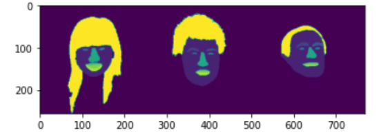

# Semantic Segmentation using UNET

We use the U-Net architechture to do semantic segmentation on **Helen** Dataset

## Architecture


------
  
## Dataset

**Helen** dataset consists 2000 train images, masks and 100 test images, masks with 11 classes.

The dataset has been resized to 256,256 for both images and segmentation masks.

  
 


----


## Model predictions on test set




## Uses

- To retrain 
```bash 
python3 train.py 
```

- To get class wise f1 scores
```bash
python3   path/to/f1_score/    path/to/test/labels    path/to/test/preds  path/to/labels_names.txt
```